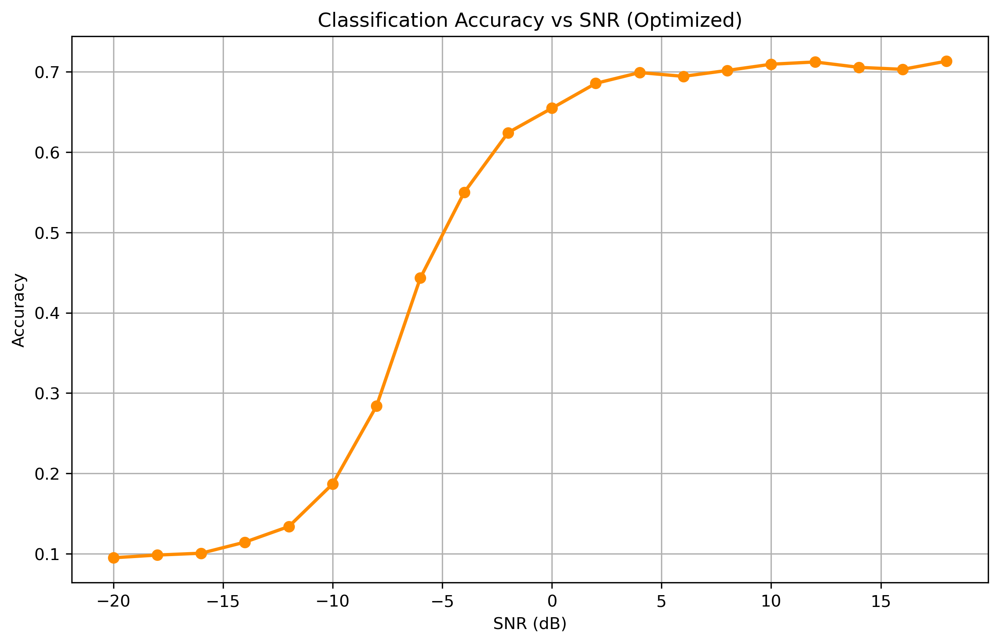
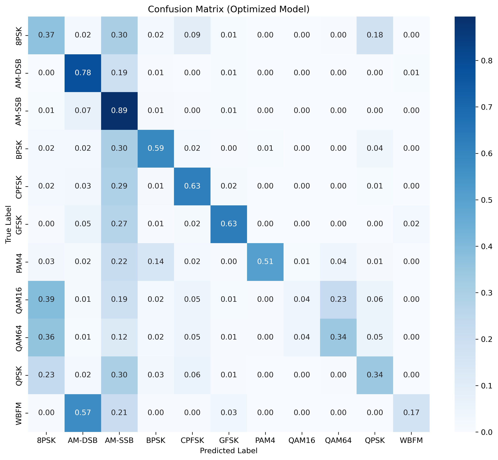
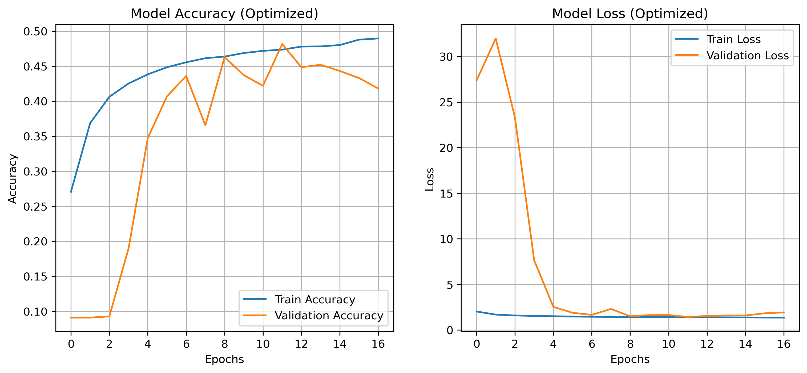

# 📡 RF Signal Modulation Classification with Deep Learning


## 📖 Project Overview
This project implements a **Deep Convolutional Neural Network (CNN)** for **Automatic Modulation Classification (AMC)**. The goal is to classify raw RF signals into their respective modulation schemes (e.g., BPSK, QAM16, QAM64) using the **RadioML 2016.10a** dataset.

AMC is a fundamental technology for **5G/6G Cognitive Radio Networks**, allowing intelligent spectrum management and interference identification without human intervention.

## 🛠️ Tech Stack & Methodology
* **Core Frameworks:** Python, TensorFlow (Keras), NumPy.
* **Data Processing:** Raw I/Q (In-Phase/Quadrature) signal processing.
* **Model Architecture:**
    * Custom 3-Block CNN with optimized filter sizes (64 -> 128 -> 256).
    * **Batch Normalization** for training stability.
    * **Dropout** layers to prevent overfitting.
* **Optimization Strategy:** Implemented `ReduceLROnPlateau` and `EarlyStopping` callbacks to dynamically adjust learning rates and stop training at the optimal point.

---

## 📊 Performance Analysis

### 1. Accuracy vs. SNR (Signal-to-Noise Ratio)
The model exhibits a robust "S-curve" characteristic typical of high-performance RF classifiers.
* **Low SNR (< -10dB):** Performance is limited by noise floor (random guessing).
* **High SNR (> 0dB):** The model achieves **~72% accuracy**, effectively recovering the signal modulation.



### 2. Confusion Matrix
The confusion matrix provides deep insights into the model's classification logic:
* **Strengths:** Excellent separation of Analog modulations (**AM-SSB, AM-DSB**) and distinct digital schemes like **GFSK**.
* **Challenges:** Expected confusion between high-order QAMs (**QAM16 vs. QAM64**) and **8PSK** due to the dense constellation diagrams and similarity in signal features at lower SNRs.



### 3. Training & Validation History
The training process was optimized to ensure generalization. The convergence of training and validation loss indicates that the model has **learned** the features rather than memorizing the dataset (no overfitting).



---

## 🚀 How to Run
To replicate these results on your local machine:

1.  **Clone the repository:**
    ```bash
    git clone [https://github.com/yusufkozann/5G-Signal-Classification-AI.git](https://github.com/yusufkozann/5G-Signal-Classification-AI.git)
    ```
2.  **Install dependencies:**
    ```bash
    pip install tensorflow numpy matplotlib seaborn scikit-learn
    ```
3.  **Download Dataset:**
    Place the `RML2016.10a_dict.pkl` file in the project root.
4.  **Run the Notebook:**
    Open `AMC_Proje_Analiz.ipynb` in Jupyter Lab/Notebook and run all cells.

---

## 📬 Contact
If you have any questions or want to discuss RF-AI applications, feel free to reach out!

* **GitHub:** [Yusuf Kozan](https://github.com/yusufkozann)
* **LinkedIn:** [Yusuf Kozan](https://www.linkedin.com/in/yusufkozan)
